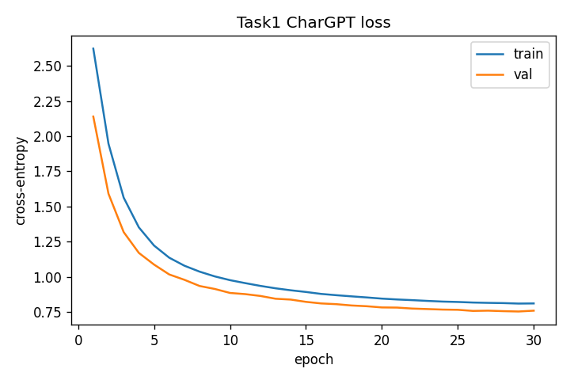
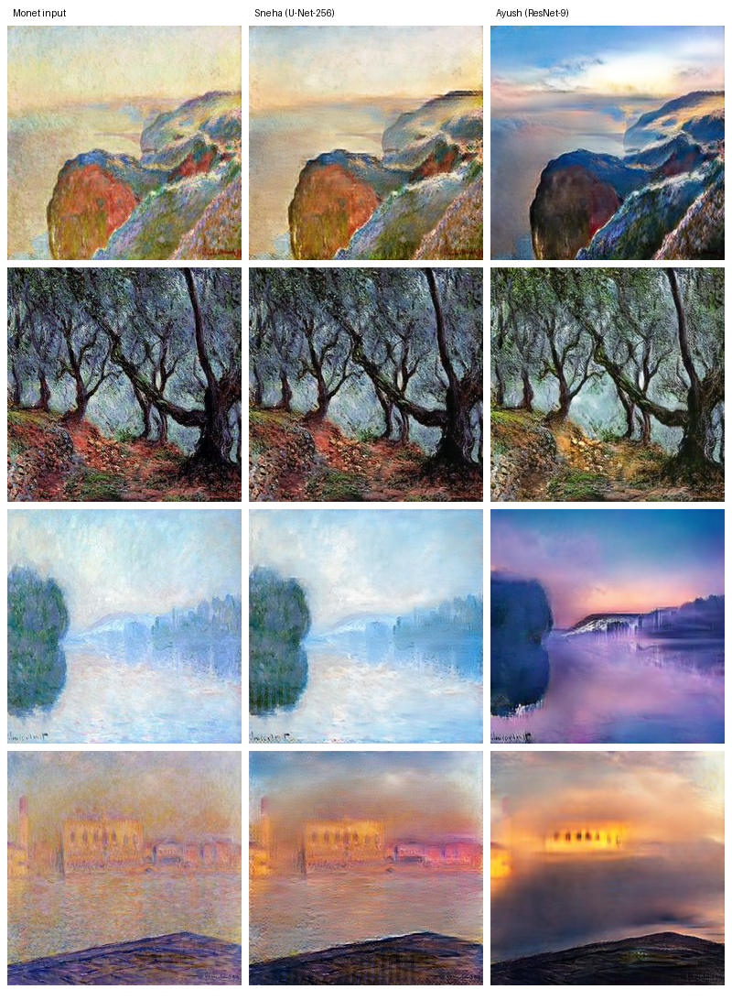
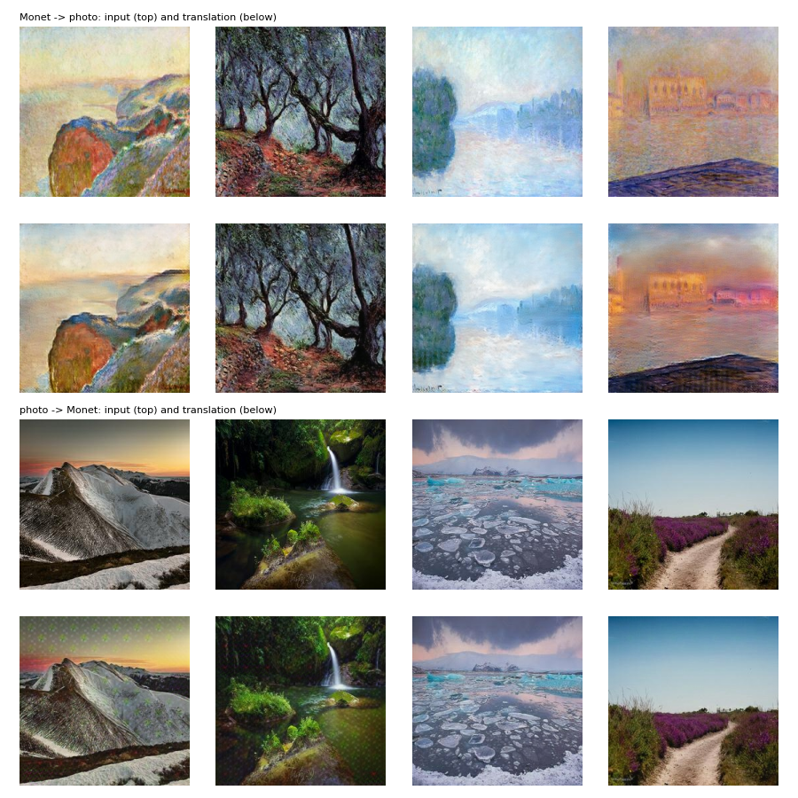

**Repository:** <https://github.com/ayushgawai/data266-lab>. Each of us works in our own folder (`ayush/`, `sneha/`); each is a complete
project root with its own code, configs, raw logs, manifests and write-ups (`results.md`, `failure_analysis.md`).

## Team ownership statement

Each of us designed, coded, trained and evaluated our own models for all three tasks, independently: **Ayush Sunil Gawai** everything under
`ayush/` and **Sneha Tumkur Narendra** everything under `sneha/`. Our models differ in architecture and hyperparameters in every task
(see the tables below). We shared the Task 2 test set (the full official 38,000-review test split), the Task 3 reference list
`ref_photos_300.txt` (the first 300 photos by filename, which the provided script scores against and which neither of us trained on), the
provided Task 3 evaluation script, the blinded human audit (both of us rated), and this report.

**Hardware:** Ayush: Tasks 1 and 2 on an NVIDIA RTX PRO 6000 Blackwell Server Edition (torch 2.11.0), Task 3 on an RTX 5080 Laptop GPU
(16 GB). Sneha: Tasks 1 and 2 and Task 3 epochs 1–70 on the SJSU GPU lab's RTX 4090 (torch 2.1.2, CUDA 12.1, Docker on WSL2); Task 3
epochs 71–120 on a Google Colab Tesla T4 (torch 2.11.0, CUDA 13.0), resumed from the lab checkpoint after the lab process was ended at
epoch 73. Every raw log records the device it ran on.

# Task 1: Character-level GPT on TinyStories

## Comparison table

| | **Ayush** | **Sneha** |
|:----------------------------|:-----------------------------------|:-----------------------------------|
| **Architecture** | Decoder-only GPT, **pre-norm**, 4 layers, 4 heads, d_model 256, d_ff 1024, **GELU**, weight tying | Decoder-only GPT, **post-norm**, 6 layers, 8 heads, d_model 256, d_ff 1024, **ReLU**, no weight tying, final LayerNorm |
| Context length | 256 characters | 128 characters |
| Data | 100K train / 10K val stories (`roneneldan/TinyStories`, seed 42); 20,000 random 256-character windows per epoch | 100K train / 10K val fixed 129-character sequences from one contiguous slice of `TinyStoriesV2-GPT4-train.txt` (seed 4242) |
| Vocabulary | 108 characters | 88 ids (87 characters + `<unk>`) |
| Optimiser | AdamW 3e-4, betas (0.9, 0.95), weight decay 0.1 on matrices | AdamW 3e-4, betas (0.9, 0.95), weight decay 0.1 on Linear weights |
| Schedule | 200-step warmup, cosine to 3e-5 | 400-step warmup (0.85%), inverse square root |
| Dropout / clipping | 0.1 / 1.0 | 0.2 / 1.0 |
| Batch / epochs | 64 / 30 | 64 / 30 (1,563 steps per epoch, 46,890 steps) |
| **Parameters** | 3,248,640 | 4,816,984 |
| Train CE / val CE (nats) | 0.8099 / 0.7584 (best val 0.7526, epoch 29) | 0.8589 / 0.8024 (best = epoch 30) |
| **Perplexity / bits per char** | **2.123 / 1.086** | 2.231 / 1.158 |
| Generalisation gap | −0.0515 | −0.0566 (eval-mode gap +0.0137) |
| Top-1 next-char accuracy | **0.7635** | 0.7477 |
| Distinct-1 / 2 / 3 | 0.0056 / 0.0472 / 0.1644 (characters) | 0.257 / 0.655 / 0.865 (words) |
| Repeated 4-gram rate | 0.823 (characters) | 0.0127 (words) |
| Grad norm max / median | 7.18 / 0.595 | 3.37 / 0.695 |
| Grad spikes / NaNs | 0 / 0 | 0 / 0 (and 0 loss spikes) |
| Train / generation tokens/s | 844,936 / 1,355 | 487,334 / 436 |
| Peak memory / training time | 1.91 GB / 181.5 s | 1.24 GB / 867.7 s |
| Hardware | RTX PRO 6000 Blackwell | RTX 4090 (SJSU lab) |

Table: Task 1 comparison

Distinct-n and the repeated 4-gram rate were computed over characters (Ayush) and over words (Sneha), so those two rows are not comparable.

{width=49%} \hfill {width=49%}

*Task 1 loss curves: Ayush (left), Sneha (right).*

## Joint analysis

- **Strengths:** Both models trained stably (0 NaNs, 0 gradient spikes), reach about 75% top-1 next-character accuracy with bits per
  character near 1.1, and produce locally fluent TinyStories-style sentences. Ayush's model is better on every likelihood metric (val CE
  0.753 vs 0.802) with a third fewer parameters, and trained in a fifth of the time (on a different, faster GPU).
- **Why:** The two designs differ in four ways at once (norm position, depth, context length, activation) plus the sampling of the data,
  so this compares two designs, not one variable. The difference we think matters most is context: with 256 characters every prediction
  conditions on twice as much of the story, and with 256-character windows his 100K sequences hold about 25.7M training characters against
  Sneha's 12.9M. Sneha's post-norm model was still improving at epoch 30, so it was undertrained rather than limited by capacity.
- **Weaknesses (both):** Neither model keeps track of who a story is about: names and pronouns change mid-story in both members'
  failure cases. Both invent words, and greedy decoding loops.
- **Limitations:** One seed each; the validation sets differ (Ayush: random windows redrawn each pass; Sneha: a fixed contiguous block),
  so the CE values are close but not on the same text.
- **Next:** The same architecture with context 128 vs 256 (one variable), and pre-norm vs post-norm at equal depth and context.

## Failure analysis (verbatim snippets)

**Ayush** (`failure_analysis.md`):

1. *Names and pronouns flip* (sample 1): "there was a princess named Daisy. Daisy loved to explore the colors and ran over to do it. He would stay in his way until he finally wanted to help her."
2. *The scene cannot be both places* (sample 20): "she was walking in the park when she saw dogs in her room."
3. *Spelling and loops* (sample 18): "The zittle girl said "Thank you, you're so smart, Mommy." From that day on, Alittle girl loved to play outside together."

**Sneha** (`failure_analysis.md`):

1. *Repetition* (greedy 04): "The bunny was so happy to see the bunny and the bunny was so happy to see the bunny and the bunny was so happy to have a new friend."
2. *Loss of coherence* (sample 01): "there was a graceful cat. The bird loved to run and said, "Good job, Tim. I made a loud noise." Tim looked around the cat and said, "My name is Sam. …" He said, "Thank you, dog.""
3. *Broken grammar and invented words* (sample 10): "Tim loved to eat long to his friends. … he asked his mom to see him lost him to read the lock right. … there was a hosple cat named Fin was friendly."

## Evidence

| | **Ayush** (`ayush/task1_llm/ayush/`) | **Sneha** (`sneha/task1_llm/sneha/`) |
|:-----------------|:---------------------------------------|:---------------------------------------|
| Metrics | `metrics_report.csv` | `metrics_report.csv` |
| Samples and curves | `outputs/generations.txt`, `outputs/loss_curves.png` | `outputs/generations.txt`, `outputs/loss_curve.png`, `outputs/train_steps.png` |
| Raw training log | `task1_chargpt_20260930T063834Z.log` | `task1_gpt_train_main_20261001T220733Z.log` |
| Manifest | `ayush_task1.json` | `sneha_task1.json` |
| Checkpoint | `chargpt_best.pt` ([Google Drive](https://drive.google.com/drive/folders/1Ks5qQSWtfKzqk8HL5nCBkAjM9iBW3Jha?usp=sharing)) | `gpt_best.pt` ([Google Drive](https://drive.google.com/drive/folders/1O6CWrI-I-WKmtVCej4znQIg0UbCRvxUB?usp=sharing)) |

Table: Evidence (paths relative to each member's task folder unless shown in full)

# Task 2: Yelp Polarity sentiment classification

All six models are trained from scratch with randomly initialised, learned embeddings (no pretrained embeddings or language models):
Adam 1e-3, batch 64, up to 5 epochs, early stopping with patience 2; vocabulary 30,000 + `<pad>`/`<unk>`, max length 256 words (CharCNN:
1,014 characters). Each of us drew our own stratified 100K train / 20K validation split (seed 42) from the official training set, and
**all six are tested on the same full 38,000-review official test set**, so the test metrics are directly comparable.

| | Ayush: TextCNN | Ayush: BiLSTM max-pool | Ayush: **BiLSTM + attention** | Sneha: mean-pool | Sneha: BiGRU max-pool | Sneha: CharCNN |
|:--------|:------------|:------------|:------------|:------------|:------------|:------------|
| Architecture | emb 128, filters 100 × (3, 4, 5), dropout 0.5 | emb 128, BiLSTM 128, max-pool, dropout 0.3 | BiLSTM 128 + additive attention pooling | masked mean of emb 128 → MLP 256 → 256 → 1 | emb 128, BiGRU 128, masked max-pool, dropout 0.3 | char emb 16, 6 conv × 256, FC 512 → 512 → 1 |
| Preprocessing | plain tokens, contractions expanded | same | same | stopwords removed (sentiment words kept), Snowball stemming | same | 69-character alphabet |
| Early stopping on | val loss | val loss | val loss | val macro-F1 | val macro-F1 | val macro-F1 |
| Parameters | 3,994,201 | 4,104,449 | 4,137,473 | 3,939,329 | 4,038,657 | 5,996,641 |
| Train time | 14.1 s | 94.4 s | 95.3 s | 18.9 s | 194.9 s | 50.1 s |
| Examples/s; peak memory | 35,458; 0.32 GB | 4,236; 0.54 GB | 4,199; 0.54 GB | 26,477; 0.22 GB | 2,565; 0.41 GB | 9,981; 1.21 GB |

Table: Task 2 models (all six trained by us from scratch)

| | Ayush: TextCNN | Ayush: BiLSTM max-pool | Ayush: **BiLSTM + attention** | Sneha: mean-pool | Sneha: BiGRU max-pool | Sneha: CharCNN |
|:--------|:------------|:------------|:------------|:------------|:------------|:------------|
| **Accuracy** | 0.9346 | 0.9368 | **0.9433** | 0.9211 | 0.9382 | 0.9045 |
|   95% CI | [0.9320, 0.9368] | [0.9346, 0.9391] | [0.9410, 0.9456] | [0.9184, 0.9240] | [0.9359, 0.9407] | [0.9015, 0.9073] |
| Macro-F1 | 0.9346 | 0.9368 | **0.9433** | 0.9211 | 0.9382 | 0.9045 |
|   95% CI | [0.9320, 0.9368] | [0.9346, 0.9391] | [0.9410, 0.9456] | [0.9183, 0.9240] | [0.9359, 0.9407] | [0.9014, 0.9073] |
| Macro P / R | 0.9346 / 0.9346 | 0.9372 / 0.9368 | 0.9433 / 0.9433 | 0.9217 / 0.9211 | 0.9383 / 0.9382 | 0.9049 / 0.9045 |
| Micro P / R / F1 | 0.9346 | 0.9368 | 0.9433 | 0.9211 | 0.9382 | 0.9045 |
| Weighted P / R / F1 | 0.9346 / 0.9346 / 0.9346 | 0.9372 / 0.9368 / 0.9368 | 0.9433 / 0.9433 / 0.9433 | 0.9217 / 0.9211 / 0.9211 | 0.9383 / 0.9382 / 0.9382 | 0.9049 / 0.9045 / 0.9045 |
| Confusion TN, FP, FN, TP | 17,790, 1,210, 1,277, 17,723 | 18,081, 919, 1,481, 17,519 | 18,042, 958, 1,198, 17,802 | 17,854, 1,146, 1,853, 17,147 | 17,927, 1,073, 1,275, 17,725 | 16,876, 2,124, 1,505, 17,495 |
| ROC-AUC / PR-AUC | 0.9823 / 0.9831 | 0.9851 / 0.9855 | **0.9859 / 0.9863** | 0.9762 / 0.9770 | 0.9848 / 0.9853 | 0.9678 / 0.9685 |
| MCC | 0.8691 | 0.8741 | **0.8866** | 0.8427 | 0.8765 | 0.8094 |
|   95% CI | [0.8640, 0.8737] | [0.8695, 0.8785] | [0.8820, 0.8912] | [0.8372, 0.8486] | [0.8718, 0.8815] | [0.8034, 0.8149] |
| Brier / ECE | 0.0495 / 0.0106 | 0.0470 / 0.0076 | **0.0431 / 0.0058** | 0.0587 / 0.0124 | 0.0462 / 0.0127 | 0.0699 / 0.0055 |
| McNemar vs own baseline | (baseline) | χ² 3.47, p = 0.062 | χ² 53.7, p = 2.3e-13 | (baseline) | χ² 199.2, p = 3.1e-45 | χ² 98.3, p = 3.6e-23 |

Table: Task 2 test metrics on the 38,000-review official test set (95% bootstrap CIs in brackets)

| | Ayush: TextCNN | Ayush: BiLSTM max-pool | Ayush: **BiLSTM + attention** | Sneha: mean-pool | Sneha: BiGRU max-pool | Sneha: CharCNN |
|:--------|:------------|:------------|:------------|:------------|:------------|:------------|
| Short (n = 8,785 / 9,051) | 0.9332; 0.064 | 0.9386; 0.059 | 0.9412; 0.056 | 0.9152; 0.082 | 0.9308; 0.067 | 0.8983; 0.097 |
| Long (n = 7,911 / 7,583) | 0.9141; 0.081 | 0.9099; 0.083 | 0.9210; 0.074 | 0.9184; 0.076 | 0.9354; 0.061 | 0.8619; 0.131 |
| Negation (n = 28,186 / 27,991) | 0.9302; 0.067 | 0.9313; 0.066 | 0.9395; 0.058 | 0.9129; 0.084 | 0.9350; 0.063 | 0.8982; 0.099 |
| Contrast (n = 22,525 / 22,221) | 0.9257; 0.074 | 0.9273; 0.072 | 0.9347; 0.065 | 0.9110; 0.088 | 0.9313; 0.068 | 0.8922; 0.107 |

Table: Task 2 test slices, macro-F1 / error rate (n = Ayush's / Sneha's slice size)

Slice sizes differ slightly because each of us defined the slices on our own tokenisation (short ≤ 50 / < 50 tokens, long ≥ 200 / > 200).

**Preprocessing ablation:** Ayush (TextCNN, one epoch): plain tokens val loss 0.207 vs stopwords + lemmatisation 0.257. Sneha (mean-pool):
stopwords removed + stemming val macro-F1 0.9212 vs neither 0.9269. Both found that stopword removal with stemming or lemmatisation **hurt**.

## Joint analysis

- **Strengths:** All six models reach 0.90–0.94 accuracy and are well calibrated (ECE ≤ 0.013). The best model overall is Ayush's
  BiLSTM + attention (accuracy 0.943, MCC 0.887, ECE 0.006); Sneha's best, the BiGRU (0.938), sits next to his max-pool BiLSTM (0.937),
  the architecturally closest model.
- **What the comparison shows:** A bag-of-words baseline already gets 92.1% (Sneha's mean-pool) and a CNN over words 93.5%, so most of the
  signal in Yelp polarity is which words appear. Word order adds a little (recurrent models +0.2 to +1.7 points). The clearest gain comes
  from **attention pooling** (Ayush: +0.65 points over max-pool, McNemar p = 3.8e-9 between the two), which can weigh the closing verdict
  of a mixed review. Reading characters instead of words (CharCNN) is worse at this data size, especially on long reviews (macro-F1 0.862,
  because it reads only the first 1,014 characters).
- **Preprocessing:** Both ablations agree that stopword removal (with stemming or lemmatisation) hurts: the lists remove negations or
  sentiment-bearing words ("not", "no"; and in Sneha's list "back", "again", "still"). Sneha protected negations with `keep_words` but
  still lost the others; Ayush trained on plain tokens with contractions expanded.
- **Weaknesses (both):** Mixed reviews whose verdict comes at the end, sarcasm and slang ("can really suck", "Keepin it real dumpy!"), and
  3-star reviews labelled positive; long reviews are the weakest slice for most models.
- **Limitations:** One seed per model; different train/validation subsets; different early-stopping criteria; 100K of the 560K training
  reviews.
- **Next:** Attention pooling on Sneha's BiGRU with plain tokens (isolates pooling from preprocessing); keep emoticons and expand
  contractions; truncate from the front instead of the back for long reviews.

## Error analysis (each member's 20-error review)

**Ayush** (BiLSTM + attention): a confident false positive, "good poker room and great structured tournaments some of the wait staff is
a little ride …" (praise words outweigh the complaint); a confident false negative, "their vacuums can really suck thank goodness" (a word
that is negative in isolation); near the threshold, "it was ok but the bread is what made me give it four stars" (mixed text, positive
label); a long review, "… however tonight was disappointing" (the model never reaches the positive verdict).

**Sneha** (BiGRU): label noise, "Wow love the place and everything is very clean and new!" (labelled negative); sarcasm, "For being a DUMP,
should expect much more. … Keepin it real dumpy!" (labelled positive); a verdict lost to cleaning, "I won't be back" (apostrophe removed,
"back" a stopword); the 3-star boundary, "… but will probably go back again" (labelled positive).

## Evidence

| | **Ayush** (`ayush/task2_sentiment/ayush/`) | **Sneha** (`sneha/task2_sentiment/sneha/`) |
|:-----------------|:---------------------------------------|:---------------------------------------|
| Metrics | `metrics_report.csv`, `outputs/mcnemar.json` | `metrics_report.csv`, `ablation_report.csv` |
| Plots and errors | `outputs/` (confusion matrices, reliability diagrams, `*_errors.jsonl`) | `outputs/` (confusion matrices, reliability diagrams, training curves, `error_review_candidates.md`) |
| Write-ups | `results.md`, `failure_analysis.md` | `results.md`, `failure_analysis.md` |
| Raw logs and manifest | `ayush/reproducibility/raw_logs/ayush/`, `ayush_task2.json` | `sneha/reproducibility/raw_logs/sneha/task2_*.log`, `sneha_task2.json` |
| Checkpoints | `textcnn.pt`, `bilstm.pt`, `bilstm_attn.pt` ([Google Drive](https://drive.google.com/drive/folders/1Ks5qQSWtfKzqk8HL5nCBkAjM9iBW3Jha?usp=sharing)) | `meanpool_best.pt`, `bigru_best.pt`, `charcnn_best.pt`, `meanpool_ablation_best.pt` ([Google Drive](https://drive.google.com/drive/folders/1O6CWrI-I-WKmtVCej4znQIg0UbCRvxUB?usp=sharing)) |

Table: Evidence (paths relative to each member's task folder unless shown in full)

# Task 3: CycleGAN, Monet ↔ photo

## Comparison table

| | **Ayush** | **Sneha** |
|:----------------------------|:-----------------------------------|:-----------------------------------|
| **Generator** | **ResNet-9** (downsample to 64×64, 9 residual blocks, upsample) | **U-Net-256** (8 stride-2 levels to 1×1, skip connections), no dropout |
| Discriminator | 70×70 PatchGAN (30×30 map, no sigmoid) | 70×70 PatchGAN (30×30 map, no sigmoid) |
| Losses | LSGAN + 10 × cycle + 5 × identity | LSGAN + 10 × cycle + 5 × identity |
| Regularisation | EMA 0.999 at inference, DiffAugment, bf16 + channels-last | EMA 0.999 at inference, DiffAugment (translation, cutout), fp32 |
| Optimiser, batch size | Adam 2e-4 (0.5, 0.999), batch 4 | Adam 2e-4 (0.5, 0.999), batch 1 |
| Schedule | 100 epochs (~1,610 steps each): constant to epoch 40, then linear decay | 120 epochs × 2,000 iterations: constant to epoch 71, then linear decay to 0 |
| Training images | all 300 Monets; 6,438 photos (`photo_train.txt`) | all 300 Monets; 6,138 photos (`photo_train_all_6138.txt`) |
| Checkpoint used | epoch 100 | best validation FID per direction: A2B epoch 30, B2A epoch 50 |
| **FID A2B / B2A** (provided script) | **84.98 / 86.42** | 107.90 / 122.38 |
| MiFID A2B / B2A | 0.414 / 0.407 | 0.426 / 0.431 |
| **Submission FID / MiFID** | **85.70 / 0.410** | 115.14 / 0.428 |
| KID A2B / B2A (mean ± std) | not computed | 0.0197 ± 0.0021 / 0.0282 ± 0.0025 |
| Density / coverage A2B; B2A | not computed | 0.877 / 0.780; 0.283 / 0.420 |
| Cycle-reconstruction L1 A / B (held-out) | not computed | 0.0401 / 0.0286 |
| LPIPS A2B / B2A | not computed | 0.132 / 0.111 |
| Content cosine A2B / B2A | not computed | 0.895 / 0.938 |
| Final cycle / identity loss, weighted; raw L1 | 0.761 / 0.261; 0.0761 / 0.0523 (epoch 100) | 0.352 / 0.112; 0.0352 / 0.0224 (epoch 120) |
| Grad norm max G / D; NaNs | 370.0 / 734.5 (epochs 51–100); 0 | 1,143.5 / 165.45; 0 |
| Parameters (all four networks) | 28,298,120 | 114,371,976 |
| Training time; images/s; peak memory | ≈ 51,200 s (14.2 h, three resumed segments); 24.4; 9.88 GB | 32,599.6 s (9.06 h); 15.0; 12.70 GB |
| Hardware | RTX 5080 Laptop GPU, 16 GB | RTX 4090 (epochs 1–70), Tesla T4 (71–120) |
| **Kaggle (public = private)** | **−43.0548** | −57.7823 |
| Human audit: style / content / artifacts (mean) | 3.66 / 4.03 / 3.56 (3.75, n = 16) | 3.54 / 4.79 / 4.25 (4.19, n = 14) |

Table: Task 3 comparison

These five metrics were not computed for Ayush's submitted epoch-100 run. Final losses are the last-epoch means with both directions summed, shown weighted
(×10 cycle, ×5 identity) and as raw L1. Neither of us trained on `ref_photos_300`.

**Kaggle:** Team PairProgramming_Team_21 was **ranked 4th** on the leaderboard (as of 6 October 2026, 4:28 pm) with −43.0548 (Ayush's submission); the board's score equals
−(FID + MiFID) / 2 of the submitted CSV. Both submissions are the provided script's output from each member's own generators, unchanged.

**Human audit:** 30 fixed samples drawn with seed 42 from both members' submitted outputs (8 / 8 / 7 / 7 across member × direction),
shuffled and renamed `audit_01`–`audit_30`, each shown as input beside translation. We both rated all 30 independently, 1–5 on style,
content and artifacts (5 = best), before opening the key. Agreement is quadratic-weighted Cohen's kappa, because the ratings are ordinal,
plus exact and within-1 agreement. Blinding is partial: we built the models, so a rater may recognise a generator's look; we rated
without discussing and committed both sheets before unblinding.

| Axis (30 samples) | Quadratic-weighted κ | Exact agreement | Within 1 | Mean, rater Ayush / rater Sneha | Spearman ρ |
|:-----------|:---------:|:---------:|:---------:|:---------:|:---------:|
| Style | **−0.19** | 0.20 | 0.47 | 4.37 / 2.83 | −0.54 |
| Content | 0.60 | 0.70 | 1.00 | 4.40 / 4.37 | +0.59 |
| Artifacts | 0.68 | 0.50 | 1.00 | 3.77 / 4.00 | +0.71 |

Table: Human audit: inter-rater agreement

Content and artifacts agree moderately to substantially (κ 0.60 and 0.68, every pair within one point). Style does not: κ is below zero
and the two rankings are opposite (ρ −0.54). The disagreement sits almost entirely on the U-Net's outputs, rated 4.93 for style by Ayush
and 2.14 by Sneha, while on the ResNet-9's outputs we were close (3.88 and 3.44). The U-Net's outputs are mostly near-copies of their
inputs; the rubric scores a near-copy low on style, and one of us appears to have scored how clean the output looks instead. So the style
axis is not reliable in this audit, and we report it as measured rather than re-rating after unblinding. Averaged over all three axes, the
audit prefers Sneha's U-Net (4.19 vs 3.75; difference 0.44, 95% bootstrap CI 0.16–0.69 over samples), but the whole margin comes from
content (4.79 vs 4.03) and artifacts (4.25 vs 3.56). That is the opposite of FID, and the same trade-off as in Figure 1: copying the
input keeps the scene and adds few artifacts, which raters reward, while FID rewards outputs that match the target domain's statistics.
Next time we would run a short calibration round on images outside the set, with anchor examples for each score, before rating.

{width=62%}

## Joint analysis

- **Strengths:** Both CycleGANs train stably with LSGAN, cycle and identity losses and produce outputs that keep the scene's layout.
  Ayush's ResNet-9 is 29.4 FID points better (85.70 vs 115.14) and gives the team its rank.
- **What the comparison shows:** On identical Monet inputs (Figure 1) the ResNet-9 really translates: real-looking skies, photographic
  contrast and colour. Sneha's U-Net stays close to the painting (median per-pixel change 5.2 / 255 for photo → Monet; content cosine
  0.938). A ResNet-9 must rebuild every pixel through a 64×64 bottleneck of residual blocks, while a U-Net's skip connections let it pass
  the input straight through; with the identity loss and a saturated discriminator (Sneha's discriminator losses at 0.02 or less from
  epoch 30), copying becomes the cheapest solution for the U-Net. The ResNet-9's stronger changes have their own cost: fine structure is
  lost in places (the buildings in the last row).
- **Training length and schedule:** Sneha's lab run was ended at epoch 73 and continued on Colab with the learning-rate decay to epoch
  120; the decay improved her Monet → photo validation FID from 120.0 to 108.9 but never beat epoch 30, so the gap is not explained by the
  schedule. Ayush's score improved from FID 98.24 (40 epochs, 2,000 photos) to 85.70 (100 epochs, 6,438 photos, EMA, DiffAugment).
- **Weaknesses:** Ayush: leftover brush texture in Monet → photo and a woven texture laid over photos in photo → Monet. Sneha: weak
  stylisation, a repeated dotted texture in flat skies (stride-2 transposed convolutions are a likely cause), smearing of thin structures.
- **What the human audit adds:** We preferred the U-Net on content and artifacts, the opposite of FID, and could not agree on style
  (κ −0.19). FID and human judgement measure different things here: domain match versus faithfulness and cleanliness.
- **Limitations:** FID on 300 images is noisy (Sneha's validation FID moved by up to 13 points between checks); the two runs differ in
  batch size, epochs, photo lists and hardware, so we compare two complete recipes, not one variable. KID, density/coverage, LPIPS, content
  cosine and held-out cycle L1 were not computed for Ayush's submitted run; the audit has 14–16 samples per model and an unreliable style
  axis.
- **Next:** Rebalance the discriminator (lower D learning rate or an R1 penalty) for the U-Net; resize-then-convolution upsampling to test
  the texture artifact; a lower identity weight; the ResNet-9 with per-direction validation checkpoint selection.

## Failure analysis (with images)

**Ayush:** *the photo is still a painting*: Monet's Houses of Parliament comes back photographic, but the water and sky keep round
colour blobs of brushwork; *the Monet changes the scene*: a woven pink texture is laid over a field and the buildings soften.

**Sneha** (images named by their input's file name): a *near-identity output*, `pred_B2A/126fb64cb8.jpg`, changes by 0.8 / 255 per
pixel; *a repeated dotted texture* on flat skies (`pred_B2A/41da9742ed.jpg`, `pred_B2A/0b1669c3ea.jpg`); and *smearing and
over-saturation* (`pred_A2B/252d9a4abc.jpg`). Her first four translations per direction are in Figure 2.

## Evidence

| | **Ayush** (`ayush/task3_gan/ayush/`) | **Sneha** (`sneha/task3_gan/sneha/`) |
|:-----------------|:---------------------------------------|:---------------------------------------|
| Kaggle file and outputs | `outputs/submission.csv`, `outputs/pred_A2B/`, `outputs/pred_B2A/` | `submission.csv`, `outputs/pred_A2B/`, `outputs/pred_B2A/` |
| Metrics | `outputs/fid_directions.txt`, `epoch100_report_metrics.md` | `metrics_report.csv` (= `full_metrics_report.csv`) |
| Curves and samples | `outputs/loss_curves.png`, `outputs/samples/` | `outputs/loss_curves.png`, `outputs/samples_epoch_010.png` … `120.png`, `outputs/train_iters.csv` |
| Raw logs and manifest | `task3_cyclegan_*.log`, `ayush_task3.json` | `task3_*.log`, `sneha_task3.json` |
| Generators | `cyclegan_epoch100.pt` ([Google Drive](https://drive.google.com/drive/folders/1Ks5qQSWtfKzqk8HL5nCBkAjM9iBW3Jha?usp=sharing)) | `generators_best.pt`, `generators_final.pt` ([Google Drive](https://drive.google.com/drive/folders/1O6CWrI-I-WKmtVCej4znQIg0UbCRvxUB?usp=sharing)) |
| Human audit | `sneha/task3_gan/audit/` (samples, both rating sheets, `agreement.csv`, `scores.csv`) | (same) |

Table: Evidence (paths relative to each member's task folder unless shown in full)

{width=62%}

# Reproducibility

- **Configs:** One config per member and task; every run writes its settings hash into its raw log and manifest.
- **Raw logs** are kept unedited in `ayush/reproducibility/raw_logs/ayush/` (Tasks 1–3, indexed in its `README.md`) and
  `sneha/reproducibility/raw_logs/sneha/` (23 logs, including the interrupted runs).
- **Manifests** record library versions, hardware and which checkpoint gives which result: `*/reproducibility/manifests/*_task{1,2,3}.json`.
- **One-command run:** `cd sneha && python smoke_test.py` (add `--task 2` or `--task 3` for the other tasks); Ayush's commands are in
  `ayush/README.md`.
- **Checkpoints** are not in git (over GitHub's size limit): Sneha's on [Google Drive](https://drive.google.com/drive/folders/1O6CWrI-I-WKmtVCej4znQIg0UbCRvxUB?usp=sharing)
  (SHA-256 in her manifests), Ayush's on [Google Drive](https://drive.google.com/drive/folders/1Ks5qQSWtfKzqk8HL5nCBkAjM9iBW3Jha?usp=sharing).
- **Data** is not in git: zipped on [Google Drive](https://drive.google.com/drive/folders/1nr_CEwNylk7HZYPPP_ufqi1lwnONS_f9?usp=sharing)
  (TinyStories V2, Yelp Polarity and the course's Monet / photo `dataset.zip`).

# References

1. A. Vaswani et al. *Attention Is All You Need.* NeurIPS 2017.
2. R. Eldan and Y. Li. *TinyStories: How Small Can Language Models Be and Still Speak Coherent English?* arXiv:2305.07759, 2023.
3. J.-Y. Zhu, T. Park, P. Isola and A. A. Efros. *Unpaired Image-to-Image Translation using Cycle-Consistent Adversarial Networks.* ICCV 2017.
4. A. Radford et al. *Improving Language Understanding by Generative Pre-Training.* OpenAI, 2018.
5. X. Zhang, J. Zhao and Y. LeCun. *Character-level Convolutional Networks for Text Classification.* NeurIPS 2015.
6. Y. Kim. *Convolutional Neural Networks for Sentence Classification.* EMNLP 2014.
7. X. Mao et al. *Least Squares Generative Adversarial Networks.* ICCV 2017.
8. S. Zhao et al. *Differentiable Augmentation for Data-Efficient GAN Training.* NeurIPS 2020.
9. M. Heusel et al. *GANs Trained by a Two Time-Scale Update Rule Converge to a Local Nash Equilibrium* (FID). NeurIPS 2017.
10. M. Bińkowski et al. *Demystifying MMD GANs* (KID). ICLR 2018.
11. M. F. Naeem et al. *Reliable Fidelity and Diversity Metrics for Generative Models* (density and coverage). ICML 2020.
12. R. Zhang et al. *The Unreasonable Effectiveness of Deep Features as a Perceptual Metric* (LPIPS). CVPR 2018.
