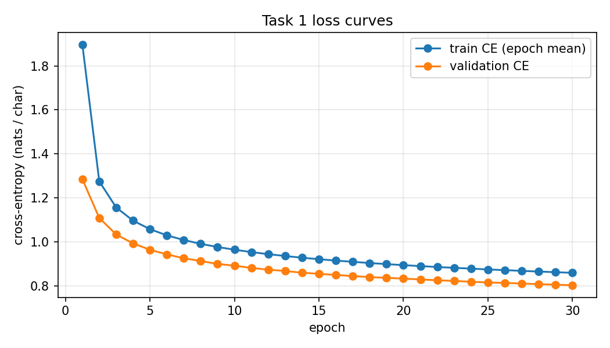

# Task 1 — Character-level GPT on TinyStories (Sneha)

**Run evidence:** checkpoint `checkpoints/gpt_best.pt` · manifest
`reproducibility/manifests/sneha_task1.json` · raw logs listed in `logs.md` ·
config `config_used.yaml` (sha256 in its first line).

## 1. What I built

Decoder-only GPT, written from scratch (section 6 of `src/task1_llm_sneha.ipynb`): learned token and positional
embeddings, N post-norm Transformer blocks (masked multi-head self-attention and a
feed-forward network, each with a residual connection and a LayerNorm), and a linear
LM head over the character vocabulary.

| Setting | Value | Why |
|---|---|---|
| Layers / heads / d_model / d_ff | 6 / 8 / 256 / 1024 | The original Transformer's block shape (6 layers, 8 heads, 4× feed-forward expansion), scaled down to d_model 256 for a small character-level corpus; head dimension 32. |
| Norm position | post | The ordering in *Attention Is All You Need* and GPT-1: sublayer, add the residual, then normalise. It also makes Ayush's pre-norm model a real contrast, and it makes the warmup a load-bearing part of the recipe rather than a formality. |
| Context length | 128 characters (`block_size`; each sequence is 129 characters: 128 inputs + 1 target) | About two short sentences of TinyStories; keeps attention cheap. The cost is that the model can't see a character introduced more than ~25 words earlier (failure 2). |
| Activation | ReLU | The original Transformer's feed-forward, which pairs with post-norm. |
| Dropout | 0.2 | Six layers on a 12.9M-character slice can overfit quickly; I wanted the model still improving at epoch 30, and it was (val CE fell every epoch, best epoch 30). |
| Final LayerNorm (`final_ln`) | yes | Every post-norm block already ends in a LayerNorm, so a final one is redundant, but harmless: it has its own affine parameters and adds only 512 weights. The brief (1.2.4) only asks for a head projecting to the vocabulary; I kept the usual GPT head (LayerNorm, then Linear) rather than make a second change I could not evaluate in the same run. |
| Weight tying | no | The original Transformer used a separate output projection. It costs one 256 × 88 matrix (22,528 weights, under 0.5% of the 4.8M parameters). |
| Optimizer / betas / weight decay | AdamW / (0.9, 0.95) / 0.1, on Linear weight matrices only (4,741,120 parameters decayed, 75,864 not) | Standard for GPT-style training. No decay on biases, LayerNorm or embeddings: shrinking a LayerNorm gain or an embedding row towards 0 is not regularisation, it changes what the layer can represent. |
| Peak LR / warmup / schedule | 3e-4 / 400 steps (0.85% of training) / inverse square root | The original paper's schedule. Post-norm puts LayerNorm after the residual sum, so early gradients at the lower layers are large and unstable without a warmup; with it the run had 0 loss spikes, 0 gradient spikes and 0 NaNs. |
| Gradient clipping | 1.0 | A safety net for post-norm; it rarely bit — the gradient norm's median was 0.695 and its maximum 3.37. |
| Batch size / epochs (1 epoch = 100K sequences) | 64 / 30 (1,563 steps per epoch, 46,890 steps) | 30 epochs is three times the brief's minimum of 10 and fitted the lab time easily (14.5 minutes). |
| Parameter count (measured) | 4,816,984 | Within the "few million parameters" range for this corpus; most of it is the 6 blocks (≈ 0.79M each). |

## 2. Data

- Split: 100K train / 10K val fixed-length sequences of 129 chars (12.9M train characters, 1.29M validation characters),
  from `TinyStoriesV2-GPT4-train.txt` (2,227,753,162 bytes, sha256 `6418d412…`).
  Validation is the *next* 10K sequences after the training slice rather than a random 10K, because sequences cut from one contiguous
  stretch of text overlap in content with their neighbours: random validation sequences would sit between training sequences from the same
  stories and leak them. A contiguous block after the training slice is text the model has never seen.
- Slice offset (`split_offset_bytes`) **1,785,390,952**, seed 4242 (my own split, as the brief asks).
- Vocabulary: **88 ids** (87 characters + `<unk>`), built from the training slice only; **3** validation characters map to `<unk>`.
- `<|endoftext|>` is replaced by one separator character (`\x03`) and shown as `<|endoftext|>` in the generations. Otherwise its 13
  characters would enter the vocabulary as ordinary text, the model would spend capacity spelling the marker, and it would distort the
  distinct-n metrics. As one character it is a clean "story ends here" symbol the model can learn to predict.

## 3. Training behaviour

From the training log (`epoch N/30` lines):

| Epoch | 1 | 10 | 20 | 29 | 30 |
|---|---|---|---|---|---|
| train CE (running, with dropout) | 1.8973 | 0.9642 | 0.8938 | 0.8618 | 0.8589 |
| val CE | 1.2850 | 0.8916 | 0.8326 | 0.8051 | **0.8024** |
| val top-1 accuracy | 0.6069 | 0.7218 | 0.7386 | 0.7468 | 0.7477 |

- **Convergence:** validation CE fell from 1.285 to 0.802 and improved at every one of the 30 epochs; the last 10 epochs still gained
  0.030. The best checkpoint is the final epoch, so the model was undertrained rather than overfitted, and more epochs or more data would
  still help.
- **Warmup and post-norm:** the 400-step warmup (0.85% of training) took the lr to its peak with no divergence, and inverse-sqrt decay
  then lowered it smoothly. There were 0 loss spikes, 0 gradient spikes and 0 NaNs (`outputs/train_steps.png`).
- **Gradient norms:** median 0.695, maximum 3.37, so clipping at 1.0 only acted on the occasional large step.
- **Train vs validation:** the running train CE is *above* validation CE at every epoch (gap −0.057 at epoch 30). That is the dropout:
  the running average is measured with dropout on, during the epoch. Measured in eval mode on the training slice, train CE is 0.789,
  slightly *below* validation (gap +0.014): a small, healthy generalisation gap.

## 4. Metrics

From `metrics_report.csv`:

| Metric | Value | Interpretation |
|---|---|---|
| Train CE / Val CE (nats) | 0.8589 (running mean over epoch 30, dropout on) / 0.8024; train CE in eval mode 0.7886 | The model assigns the true next character an average probability of e^−0.80 ≈ 0.45 on unseen text. |
| Perplexity / bits per char | 2.231 / 1.158 | On average the model is as unsure as a choice between about 2.2 equally likely characters. A per-character number: not comparable to word-level perplexity, which counts much bigger units. |
| Generalization gap (`gen_gap`, `gen_gap_eval`) | −0.0566 / +0.0137 | Negative only because of dropout during training; in eval mode the gap is a small +0.014, so with 12.9M characters and dropout 0.2 the model is not memorising its slice. |
| Top-1 next-char accuracy | 0.7477 | Three in four next characters are the model's top choice; the remaining quarter is where sampling can go astray (failure 3). |
| Distinct-1/2/3, repeated 4-gram rate | 0.257 / 0.655 / 0.865, 0.0127 (word level, whitespace split, over the 20 sampled stories at temperature 0.8) | Sampled text varies a lot at the phrase level and rarely repeats 4-word sequences; the vocabulary is small (distinct-1 0.257), as TinyStories is. Greedy decoding loops badly (failure 1). |
| Grad norm max / median, spikes, NaN count | 3.37 / 0.695, 0 loss spikes and 0 gradient spikes, 0 NaN | A stable run from start to end. |
| Train tokens/s, generation tokens/s | 487,334 / 435.9 (batch 1) | Training is fast batched; generation is slow because it runs one character at a time with no key-value cache. |
| Peak memory, total training time | 1.24 GB, 867.7 s (14.5 min; 788.0 s of compute) | A small model; a fraction of the 4090's 24 GB. |
| Hardware | NVIDIA GeForce RTX 4090, SJSU GPU lab (Docker on WSL2), torch 2.1.2, CUDA 12.1 | |

## 5. Comparison with Ayush's model

Ayush (`ayush/task1_llm/ayush/results.md`): pre-norm, 4 layers, 4 heads, context 256, GELU, dropout 0.1, weight tying, cosine schedule,
3,248,640 parameters; best val CE **0.753** (bpc 1.09), top-1 0.763 — against my 0.802 (bpc 1.158), top-1 0.748.

Four architecture choices differ (norm position, depth, context and activation), plus the data (he draws 20,000 random 256-character
windows per epoch from 100K stories, I use 100K fixed 128-character sequences), so this compares two whole designs, not one variable.
The difference I would point to is context: his model sees 256 characters, twice my 128, and every prediction in the second half of a
window has more of the story to condition on, which lowers CE and helps keep characters consistent. Our distinct-n numbers can't be
compared directly: mine are over words, his over characters (his distinct-1 is 0.0056).

## 6. Limitations and what I would try next

- **Short context.** 128 characters is about 25 words, so names and objects introduced earlier are forgotten (failure 2).
  Next: the same model with `block_size` 256, everything else equal, to measure what context alone is worth.
- **Undertrained.** Validation CE was still falling at epoch 30. Next: more epochs or a larger slice, watching for the eval-mode gap to grow.
- **Spelling at the character level.** Sampling at temperature 0.8 sometimes produces non-words (failure 3). Next: measure the non-word
  rate at temperatures 0.5, 0.8 and 1.0.
- **Greedy decoding loops** (failure 1); generation has no key-value cache, so it is slow.
- With ten times the compute, I would spend it first on context length and data rather than more layers, because the model is undertrained
  and its main failures are about memory, not capacity.
