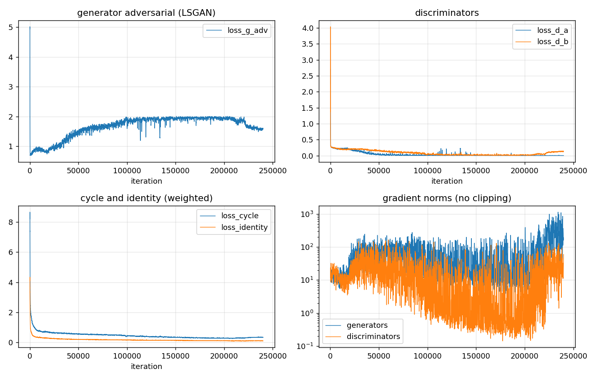
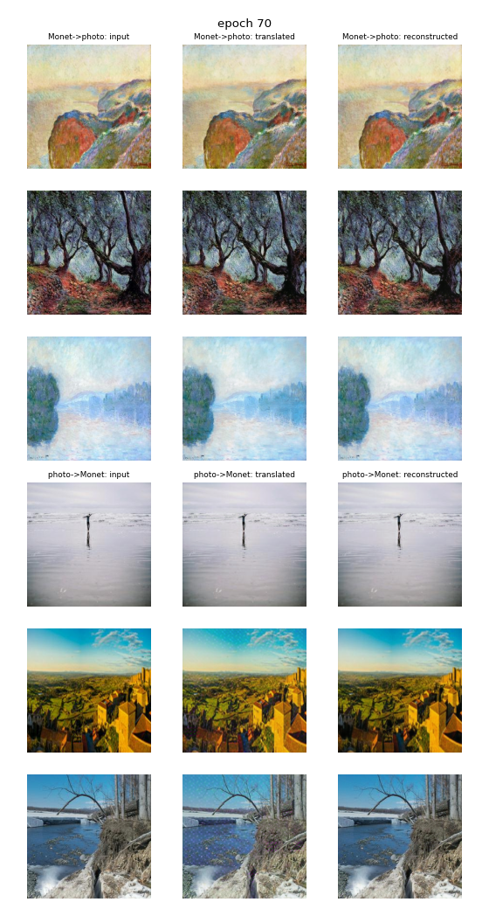

# Task 3 — CycleGAN, Monet ↔ Photo (Sneha)

**Run evidence:** notebook `src/task3_gan_sneha.ipynb` (saved with outputs) · generators
`checkpoints/generators_best.pt` (link: ______, sha256 in the manifest) · manifest
`reproducibility/manifests/sneha_task3.json` · raw logs listed in `logs.md`.

## 0. How the run went (hardware disclosure)

| Stage | Hardware | Settings | What happened | Raw log |
|---|---|---|---|---|
| Lab, 1 Oct | NVIDIA GeForce RTX 4090 (24 GB), torch 2.1.2, CUDA 12.1, Docker on WSL2 | `config.yaml` (400 epochs planned, constant lr to epoch 200) | Two short starts were stopped by hand during epoch 4. The main run trained epochs 1–73; the process was then ended on the lab machine with no error message. `cyclegan_last.pt` holds epoch 70 (140,000 iterations, 8,215.8 s of training). | `task3_train_main_20261001T232254Z.log`, `…T233326Z.log`, `…T234239Z.log` |
| Colab, 5 Oct, first attempt | Tesla T4 (15 GB), torch 2.11.0, CUDA 13.0 | `config_colab_submit.yaml` | Stopped while loading the checkpoint: the saved RNG states had been moved to the GPU (`TypeError`). Fixed in commit `304f8e3`. | `task3_train_main_20261005T193327Z.log` |
| Colab step A | Tesla T4 | `config_colab_submit.yaml` (`epochs: 70`) | Resumed at epoch 70 with no training; submission and metrics from `generators_best.pt` as saved in the lab. | `task3_train_main_20261005T200623Z.log`, `task3_submission_main_20261005T200655Z.log`, `task3_metrics_main_20261005T200803Z.log` |
| Colab step B, 5 Oct | Tesla T4 | `config_colab_resume.yaml` | Resumed at epoch 70: constant lr through epoch 71, then linear decay towards 0 at epoch 120 (about 8 min/epoch, 244 ms/iteration). Trained epochs 71–102; Colab then ended the session during epoch 103 (GPU usage limit). | `task3_train_main_20261005T203622Z.log` |
| Colab step B, resumed, 5–6 Oct | Tesla T4 (new Colab session) | `config_colab_resume.yaml` | Resumed from the epoch-100 checkpoint and trained epochs 101–120 (epochs 101–102 were redone), then the submission and metrics. No later epoch beat the saved best generators, so the submission uses the same generators as step A. | `task3_train_main_20261006T022031Z.log`, `task3_submission_main_20261006T050526Z.log`, `task3_metrics_main_20261006T050637Z.log` |

## 1. What I built (brief 3.1)

| Setting | Value | Why |
|---|---|---|
| Generator | U-Net-256: 8 stride-2 encoder convolutions down to 1×1, with skip connections; 54,419,459 parameters each | Ayush uses ResNet-9 and our models must differ; the U-Net is the other generator in the official CycleGAN/pix2pix code, so nothing is improvised. Its skips carry full-resolution detail from encoder to decoder, so I expected strong content preservation and weaker stylisation, and that is what I measured: content cosine 0.895 / 0.938, LPIPS 0.132 / 0.111. |
| Decoder dropout (`unet_dropout`) | 0.0 | The official CycleGAN runs this generator without dropout. With 0.5, `model.eval()` turns it off at inference, so the validated and submitted generator would behave differently from the trained one. |
| Discriminator | 70×70 PatchGAN (30×30 output); 2,766,529 parameters each | The CycleGAN discriminator: each of its 900 scores judges one 70×70 patch, which targets texture and brushwork (what style is) rather than global layout, with far fewer parameters than a full-image discriminator. No sigmoid, because LSGAN expects raw scores. |
| Losses | LSGAN + 10 × cycle L1 + 5 × identity L1 | The paper's losses. Least squares keeps gradients for fakes far from the decision boundary (0 NaNs in 140,000 iterations); the cycle term makes the unpaired mapping invertible; the identity term (0.5 × cycle, as the paper uses for painting ↔ photo) stops colours drifting. |
| Optimiser / schedule | Adam 2e-4 (0.5, 0.999), 2,000 iterations per epoch. Lab: 400 epochs planned (constant lr for 200), stopped after 73. Colab step B: resumed at epoch 70, constant through epoch 71, then linear decay to 0 at epoch 120 (120 epochs, 240,000 iterations in total). | The paper's optimiser and schedule shape (constant, then linear to 0). The lab run was cut at epoch 73, still at the constant lr, so step B spent the time left on the decay: 50 epochs × 2,000 = 100K decay iterations, the paper's decay length (100 epochs of about 1,000 images). |
| Image pool / batch / augmentation | 50 / 1 / resize 286 (bicubic), random crop 256, horizontal flip | The paper's settings. The pool shows the discriminator older fakes too, so it can't just chase the generator's latest output; crops and flips multiply the 300 Monets. |
| EMA generator weights | yes, decay 0.999; validation and the submission use the EMA weights | GAN weights oscillate from step to step; averaging over roughly the last 1,000 steps gives a smoother generator to evaluate. Even with EMA, validation FID moved by up to 13 points between checks (A2B 108.5 → 121.5 from epoch 40 to 50). |
| DiffAugment policy | translation, cutout (no colour), on every discriminator input | With only 300 Monets the discriminator can memorise them; DiffAugment applies the same differentiable transforms to real and fake images so it can't. No colour jitter, because colour is most of what makes a Monet a Monet. It slowed but did not stop discriminator dominance: D_A fell from 0.204 (epoch 10) to 0.016 (epoch 70). |
| Parameters (measured) | 114,371,976 in total (2 generators + 2 discriminators) | 95% of it is the two U-Nets. |
| Hardware, training time, images/s, peak memory | Epochs 1–70: RTX 4090, 8,215.8 s (2.28 h), 35.4 images/s; peak memory 10.24 GB (pre-flight, lab). Epochs 71–120: Tesla T4, about 8 min per epoch (about 8 images/s); peak memory 12.70 GB (T4, last session). Total for all 120 epochs: 32,599.6 s (9.06 h), 15.0 images/s on average. | The 4090 run was ended by the lab machine; the rest ran on a Colab T4 from the same checkpoint, about 4.5× slower per iteration (244 ms vs 54 ms). |

Data: all 300 Monets; the 6,138 photos in `photo_train_all_6138.txt` (every photo outside the three held-out lists). The 300 reference
photos the provided script scores against (`ref_photos_300.txt`) are never trained on.
Generators chosen by validation FID, each on its own direction (`select_per_direction`): Monet → photo from epoch **30**, photo → Monet from epoch **50**
— after all 120 epochs too: no later validation beat them (best later values: A2B 108.89 at epoch 120, B2A 123.27 at epoch 80).
Stopped at `train_until`: no; all 120 planned epochs ran (`epochs_run` 120).

## 2. Training behaviour and stability (brief 3.1.5, 3.2.3)

Validation FID of the EMA generators (300 Monets → photo, against `val_photos_300`; the 300 validation photos → Monet, against the 300 Monets).
Epochs 10–70 from the lab log (constant lr), 80–120 from the Colab logs (linear decay):

| Epoch | 10 | 20 | 30 | 40 | 50 | 60 | 70 | 80 | 90 | 100 | 110 | 120 |
|---|---|---|---|---|---|---|---|---|---|---|---|---|
| val FID A2B | 114.91 | 108.01 | **106.79** | 108.50 | 121.49 | 117.83 | 120.01 | 121.26 | 115.34 | 115.44 | 112.86 | 108.89 |
| val FID B2A | 132.35 | 126.86 | 130.13 | 140.77 | **123.09** | 125.73 | 124.04 | 123.27 | 124.24 | 124.42 | 124.03 | 123.84 |

Epoch-mean losses (`epoch N/…` log lines; cycle and identity are weighted as in the loss):

| Epoch | G adversarial | cycle | identity | D_A | D_B |
|---|---|---|---|---|---|
| 1 | 0.772 | 2.259 | 0.962 | 0.300 | 0.292 |
| 10 | 0.855 | 0.693 | 0.291 | 0.204 | 0.200 |
| 30 | 1.560 | 0.545 | 0.203 | 0.024 | 0.125 |
| 50 | 1.882 | 0.429 | 0.170 | 0.013 | 0.032 |
| 70 | 1.889 | 0.374 | 0.154 | 0.016 | 0.022 |
| 90 | 1.942 | 0.310 | 0.126 | 0.002 | 0.017 |
| 100 | 1.943 | 0.299 | 0.117 | 0.001 | 0.020 |
| 110 | 1.863 | 0.303 | 0.111 | 0.0005 | 0.045 |
| 120 | 1.572 | 0.352 | 0.112 | 0.0002 | 0.131 |

- **Reconstruction converged.** The weighted cycle loss fell from 2.26 to 0.37 and the identity loss from 0.96 to 0.15, smoothly and still slowly falling at epoch 70.
- **The discriminators won the adversarial game.** For the first ~20,000 iterations the two sides were balanced (D losses near 0.2, the generator's adversarial loss near 0.85). After that both discriminator losses fell towards 0 (D_A 0.024 by epoch 30, 0.016 by epoch 70) while the generator's adversarial loss rose to about 1.9 and stayed there. The gradient norms show the same thing: the generators' grew from about 10 to 100+ after iteration 20,000, while the discriminators' fell below 1 after iteration 100,000 — a saturated discriminator that the generator can no longer move.
- **Validation FID tracks this.** Monet → photo was best at epoch 30 (106.79), when the discriminators were just taking over, and then got worse (117.8–121.5 at epochs 50–70). Photo → Monet stayed noisy between 123 and 141, best at epoch 50. Once the discriminator separates real from fake easily, its gradient stops telling the generator how to look more real, and the generator settles on what the cycle and identity terms reward: changing the image as little as possible (section 3).
- **The decay helped one direction.** Over epochs 71–120 the lr fell linearly to 0. Monet → photo improved from 120.01 (epoch 70) to 108.89 (epoch 120), most of it in the last 20 epochs, but never beat epoch 30 (106.79). Photo → Monet did not move (123.3–124.4).
- **The photo discriminator loosened only at the very end.** In epochs 105–120, as the lr approached 0, D_B's loss rose from about 0.02 to 0.13 and the generator's adversarial loss fell from 1.94 to 1.57, while the weighted cycle loss rose again (0.29 → 0.35): the Monet → photo generator was changing images more, which is when its FID improved fastest. D_A (the Monet discriminator) stayed saturated throughout (0.0002 at epoch 120), which fits photo → Monet never improving.
- **Numerically stable.** 0 NaNs in 240,000 iterations, without gradient clipping; the largest generator gradient norm was 1,143.5 (during the Colab epochs; 277.97 in the lab epochs), the discriminators' 165.45.

## 3. Visual quality and cycle consistency (brief 3.2.1, 3.2.2)

- **Photo → Monet barely stylises.** The outputs keep the photo's layout, lighting and sharp detail and show almost no brushwork: mostly a slight colour shift plus a faint repeated dotted texture in flat areas such as skies (`failure_analysis.md`, modes 1 and 2). Measured over all 300 outputs, the mean absolute change per pixel from input to output is only 5.2 out of 255 (median; 10th–90th percentile 1.9–11.6). Density 0.283 and coverage 0.420 against the real Monets say the same: the "Monets" sit outside the real Monet feature distribution.
- **Monet → photo changes more but still looks painted.** Median per-pixel change 12.6 (4.5–19.1). Brushstrokes survive; the most-changed outputs get smoother, more saturated and more contrasted, sometimes with smeared fine structure (mode 3).
- **Content is preserved very strongly in both directions**, as the U-Net's skips predict: content cosine 0.895 (A2B) and 0.938 (B2A), LPIPS 0.132 and 0.111.
- **Cycle consistency holds** — reconstruction L1 is 0.0401 (Monet → photo → Monet) and 0.0286 (photo → Monet → photo), and the reconstructed column of `samples_epoch_070.png` is indistinguishable from the input. But here it is weak evidence of good translation: when both generators are close to the identity, the cycle is satisfied almost for free.

## 4. Metrics, both directions

From `metrics_report.csv`, generators A2B from epoch 30 and B2A from epoch 50 (`generators_best.pt`, sha256 `aa1998bd…`). Step A and the
final run after 120 epochs used the same generators; their FIDs differ only in the third decimal (115.1365 vs 115.1360, inference noise),
and every other metric below is the same to the precision shown:

| Metric | Monet → photo (A2B) | Photo → Monet (B2A) |
|---|---|---|
| FID (provided script) | 107.90 | 122.38 |
| MiFID (provided script) | 0.4256 | 0.4308 |
| KID mean ± std | 0.0197 ± 0.0021 | 0.0282 ± 0.0025 |
| Density / coverage | 0.877 / 0.780 | 0.283 / 0.420 |
| Cycle-reconstruction L1 | 0.0401 | 0.0286 |
| LPIPS (input vs translation) | 0.132 | 0.111 |
| Content cosine (input vs translation) | 0.895 | 0.938 |

Submission FID (mean of both directions) **115.137**, MiFID 0.428. The provided script's FIDs are within 1.1 points of the validation FIDs the
generators were chosen on (106.79 and 123.09), so the validation set is a reliable stand-in for the submission.
Final cycle / identity loss (epoch 120 mean) 0.352 / 0.112 · max gradient norm G 1,143.5 / D 165.45 · NaN count 0 ·
human audit score and kappa per axis: ______ (team, `task3_gan/audit/agreement.csv`).

## 5. Kaggle (brief 3.2.5)

Team `PairProgramming_Team_21` · submitted `submission.csv` from step A (sha256 in the manifest) on 5 Oct 2026 ·
score **−57.7823** (public = private: the leaderboard "is calculated with all of the test data") ·
team rank **5**, from the team's best submission (Ayush, −43.0548).
Kaggle's score is −(FID + MiFID) / 2 of the CSV: −(115.137 + 0.428) / 2 = −57.782.
Not resubmitted after step B: the final `submission.csv` (FID 115.136) comes from the same generators.

## 6. Comparison with Ayush's model, shortcomings, next steps (brief 3.2.4)

**Comparison.** Ayush (`ayush/task3_gan/ayush/results.md`): ResNet-9 generator, batch 4, 100 epochs (constant lr through epoch 40, then linear
decay), 6,438 training photos, EMA and DiffAugment; FID 85.70, MiFID 0.410, Kaggle −43.0548 — 29.4 FID points better than my step A (115.14).
The structural difference is the generator. A ResNet-9 must rebuild every output pixel through a downsampled 64×64 bottleneck of residual
blocks, while my U-Net can pass the input straight through its skip connections; my near-identity outputs (median change 5.2 / 255 for
photo → Monet) are the measured consequence. The comparison is not one variable: we also differ in batch size (4 vs 1) and schedule
(his decay ran from epoch 41 to 100, mine from 72 to 120). But after my full 120-epoch run with its decay, my best validation FIDs were
still 106.79 / 123.09 against his 85.70 mean, so the missing decay was not what held my model back.

**Shortcomings.**
- Weak stylisation, above all photo → Monet: the generator learned to change images as little as possible.
- Discriminator dominance from about epoch 20, which DiffAugment did not prevent.
- A repeated texture artifact in flat regions (failure mode 2).
- The run was interrupted twice and split across two kinds of GPU (lab RTX 4090, then Colab T4 over two sessions).
- FID on 300 images is noisy: validation FID moved by up to 13 points between checks, so differences of a few points are not meaningful.

**Next steps**, each a single change to test one explanation:
1. Rebalance the adversarial game — a lower discriminator learning rate (for example 1e-4 against 2e-4) or an R1 gradient penalty — and check whether D losses stay above about 0.1 and validation FID keeps improving after epoch 30.
2. Lower the identity weight from 5 to 0 or 1, to test whether the identity term is what pulls the generators towards copying.
3. Replace the transposed convolutions with resize-then-convolution upsampling, to test whether the repeated texture comes from them.
